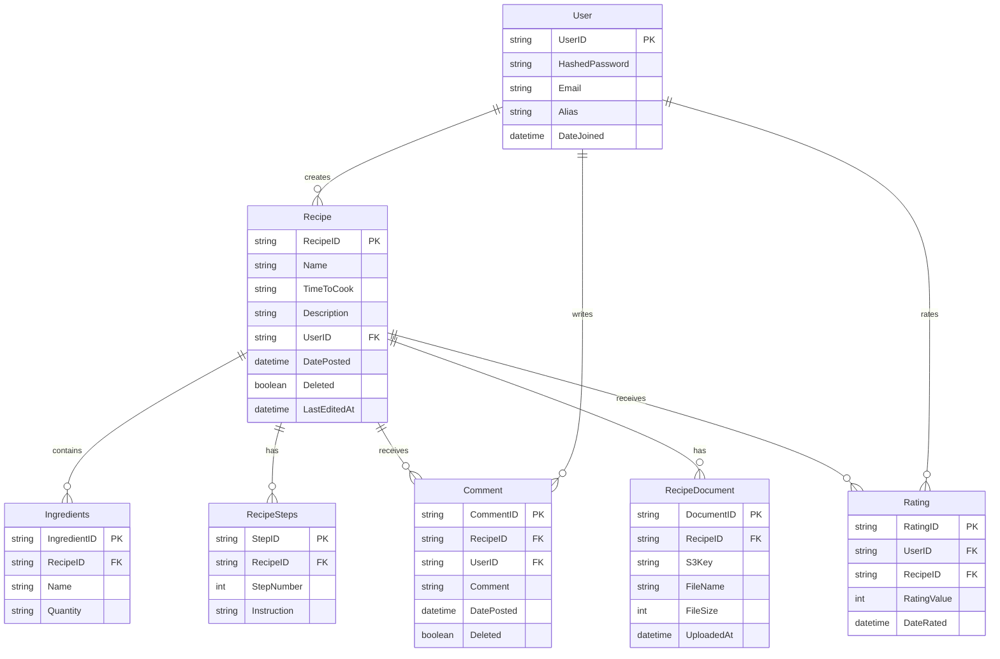

# Project Structure
We're going to use a repository pattern to accomplish this project. It should be pretty straightforward and provide nice abstractions for the frontend to use when we get there.

We'll need the following tables:
- Users
- Recipes
- Recipe Steps
- Recipe Document (PDF only)
- Ingredients
- Comments
- Ratings 

These should be pretty easy to set up, and I think the repository pattern would be perfect. Go also offers a lot of options in its standard library that will make things like auth enjoyable. 

We'll use postgres as our DB and run it in Docker. We'll also run the back and front end in docker for simplicity. 

I'm not exactly sure how we're going to deploy this yet, I'll need to do some work there. I imagine it will eventually end up in AWS - but that is a problem for when we get there. 

## Data Model

