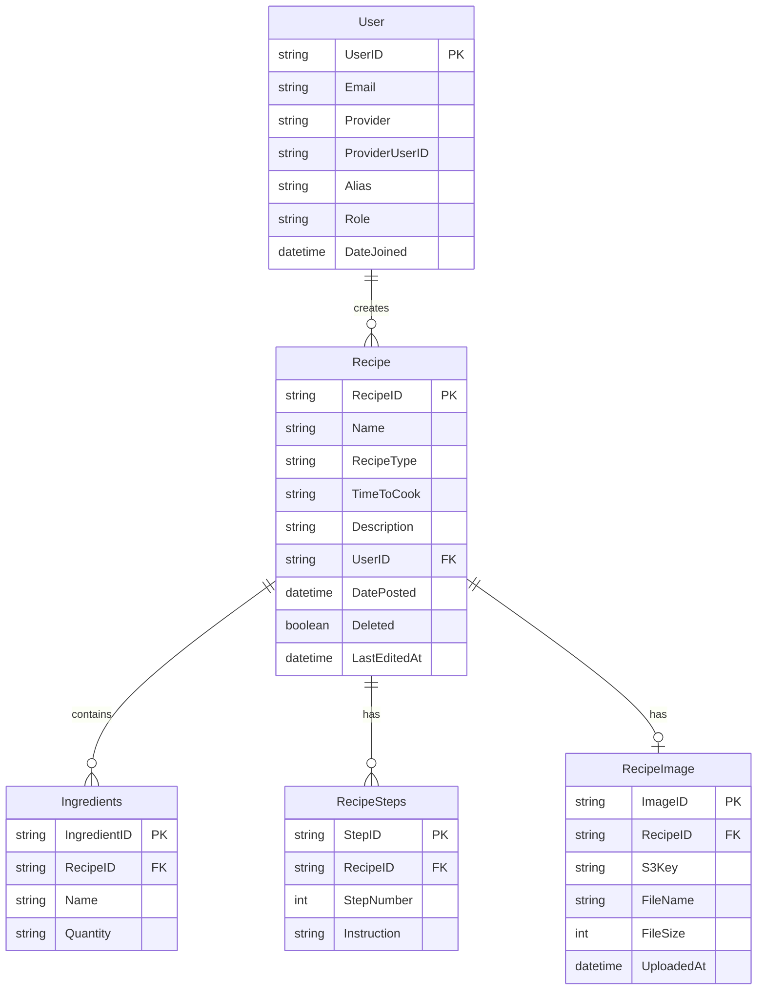

# Project Structure

A private, shared cookbook for me, my girlfriend, and (one day) family. The goal of v1 is
something we'll actually *finish and use* — so the scope is deliberately small. Anything that
smells like a public, multi-user platform is punted to "One Day" at the bottom.

We use a **repository pattern** over Postgres. It gives the handlers clean abstractions to call
and gives the frontend a stable API to consume. Handlers are built on Go's standard library.

## Decisions (v1)

- **Scope:** private cookbook. No comments, no ratings, no public sign-up. Users still carry a
  `Role` field so growing into multi-user later is cheap.
- **Auth:** Google OAuth (OIDC). We store *no* passwords — we consume Google as the identity
  provider and keep a stable `ProviderUserID` + verified email per user.
- **Recipes are either/or:** a `RecipeType` discriminator marks a recipe as `structured`
  (Ingredients + Steps rows) or `image` (an uploaded photo). Same list view, different detail
  view — never both half-populated.
- **Uploads normalize on the way in:** accept any image (HEIC/PNG/JPEG/etc.), convert to a
  single web format (JPEG for now), store in S3, serve with a plain ``. This gives us the
  "one kind of file" simplicity without a PDF viewer.

## Tables

- Users
- Recipes
- Recipe Steps
- Ingredients
- Recipe Image (normalized photo in S3, for `image`-type recipes)

## Infrastructure

- **DB:** Postgres. Local via Docker; AWS via RDS. (RDS is the one always-on cost to watch —
  compare a tiny instance vs Aurora Serverless v2 min-capacity before committing.)
- **Backend:** Go, containerized, on **ECS Fargate**. No servers to babysit.
- **Frontend:** React, spun up as a separate app from the Go backend.
- **Everything else:** Terraform. Beats clicking around the console.

## Data Model

## One Day (deferred on purpose)

Written down so it's out of my head and off the critical path:

- **Comments & Ratings** — only make sense on a public/multi-user site.
- **Family / multi-user** — open sign-up beyond the two of us. The `Role` field is the seam.
- **LLM/OCR** — send a stored recipe photo to an LLM to extract editable, searchable
  structured text (turn an `image` recipe into a `structured` one).
